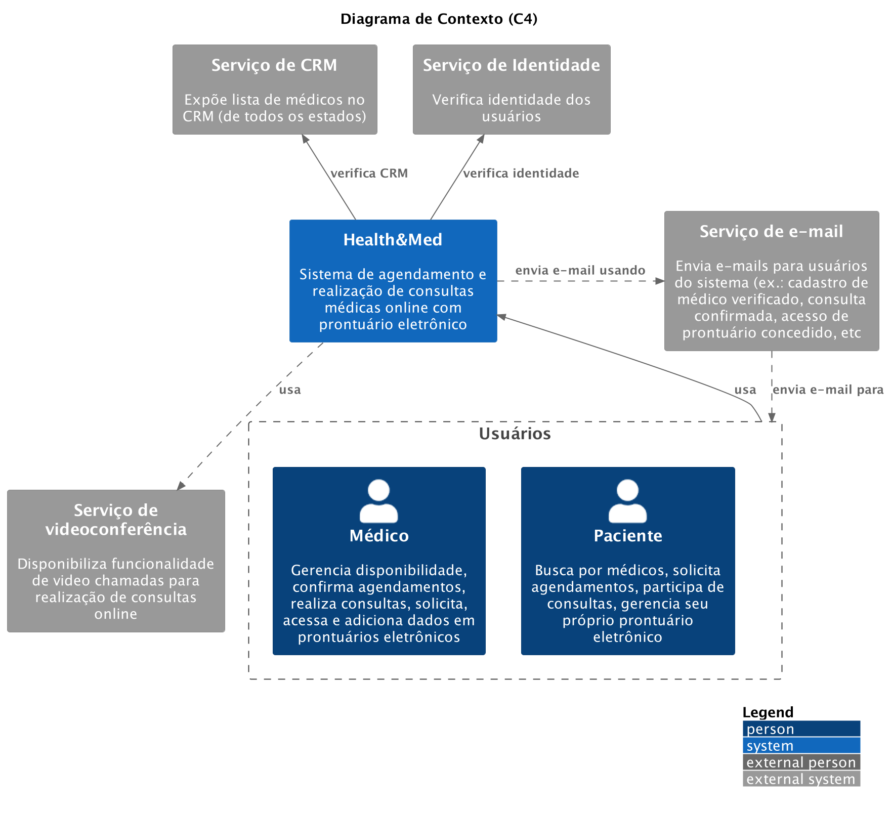
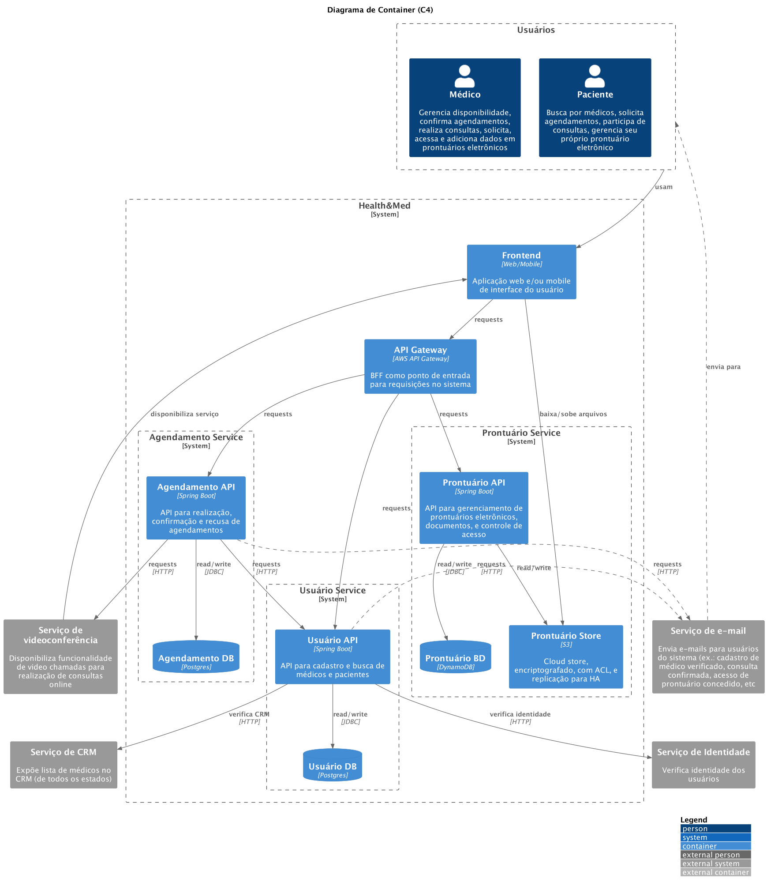
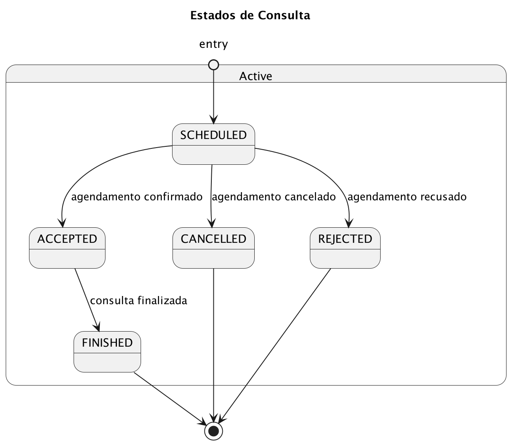

# Health&Med


Grupo 15:

- Bleno Humberto Claus
- Giovanni Di Luca Evangelista
- Lucas Gabriel dos Santos
- Mateus Sales Albino
- Wellyson de Freitas Santos

## MVP

[](https://sonarcloud.io/summary/new_code?id=FIAP-3SOAT-G15_healthmed-app)
[](https://sonarcloud.io/summary/new_code?id=FIAP-3SOAT-G15_healthmed-app)

Nosso MVP é uma versão simplificada para fins de demonstração dos requisitos atendidos durante o Hackathon. Compreende um monolito com um banco de dados relacional e uso de serviços serverless na AWS. Toda a infraestrutura descrita em Terraform e a imagem da aplicação são automatizados em nossas pipelines com GitHub Actions, que inclui verificação dos testes e análise estática no SonarQube.

Projeto no SonarCloud: https://sonarcloud.io/project/overview?id=FIAP-3SOAT-G15_healthmed-app

Também criamos uma extensa documentação para suportar uma aplicação escalável e resiliente que atenda a todos os requisitos não funcionais.

## Requisitos

[Pular requisitos ↓](#decisoes-de-arquitetura)

Health&Med, uma startup inovadora no setor de saúde, está desenvolvendo um novo sistema que irá revolucionar a Telemedicina no país. Atualmente, a startup oferece a possibilidade de agendamento de consultas e realização de consultas online (Telemedicina) por meio de sistemas terceiros como Google Agenda e Google Meetings.

Recentemente, a empresa recebeu um aporte e decidiu investir no desenvolvimento de um sistema proprietário, visando proporcionar um serviço de maior qualidade, segurança dos dados dos pacientes e redução de custos. O objetivo é criar um sistema robusto, escalável e seguro que permita o gerenciamento eficiente desses agendamentos e consultas.

Além de conter as funcionalidades de agendamento e realização de consultas online, o sistema terá o diferencial de uma nova funcionalidade: o Prontuário Eletrônico. O Prontuário Eletrônico permitirá o armazenamento e compartilhamento de documentos, exames, cartão de vacinas, e outros registros médicos entre as partes envolvidas, garantindo maior assertividade nos diagnósticos.

Para viabilizar o desenvolvimento de um sistema que esteja em conformidade com as melhores práticas de qualidade e arquitetura de software, a Health&Med contratou os alunos do curso (SOAT) para fazer a análise do projeto e a arquitetura do software.

### Requisitos Funcionais

#### 1. Autenticação do Usuário (Médico)

- O sistema deve permitir que o médico faça login usando o número de CRM e uma senha.

#### 2. Cadastro/Edição de Horários Disponíveis (Médico)

- O sistema deve permitir que o médico cadastre e edite os horários disponíveis para agendamento de consultas.

#### 3. Aceite ou Recusa de Consultas Médicas (Médico)

- O médico deve poder aceitar ou recusar consultas médicas agendadas.

#### 4. Autenticação do Usuário (Paciente)

- O sistema deve permitir que o paciente faça login usando um e-mail, CPF e uma senha.

#### 5. Busca por Médicos (Paciente)

- O sistema deve permitir que o paciente visualize a lista de médicos disponíveis, utilizando filtros como especialidade, distância (em kms) e avaliação.

#### 6. Agendamento de Consultas (Paciente)

- Após selecionar o médico, o paciente deve poder visualizar a agenda do médico e o valor da consulta, e efetuar o agendamento.
- O usuário paciente poderá cancelar a consulta mediante justificativa.

#### 7. Teleconsulta

- A consulta agendada deve criar um link de reunião online de duração padrão de 50 minutos que será utilizado pelo usuário e pelo médico no dia da consulta.

#### 8. Prontuário Eletrônico

- Acesso e Upload:
  - O paciente deve poder acessar seu prontuário eletrônico e fazer o upload de arquivos, como exames e laudos médicos.
- Gestão de Compartilhamento:
  - O paciente deve poder compartilhar seu prontuário com médicos, definindo quais arquivos ou grupos de arquivos serão acessíveis e por quanto tempo.

### Requisitos Não Funcionais

#### 1. Alta Disponibilidade

- O sistema deve estar disponível 24/7 devido à sua natureza crítica no setor de saúde.

#### 2. Escalabilidade

- O sistema deve ser capaz de lidar com alta demanda, especialmente para profissionais muito procurados.
- O sistema deve suportar até 20.000 usuários simultâneos em horários de pico.

#### 3. Segurança

- O prontuário eletrônico deve possuir alta camada de segurança para prevenir falhas no compartilhamento de documentos.
- A proteção dos dados sensíveis dos pacientes deve seguir as melhores práticas de segurança da informação.

### Entregáveis Mínimos

Os grupos deverão entregar o seguinte:

#### Desenho da Solução MVP

- Diagrama da arquitetura que atenda aos requisitos funcionais e justificativas das escolhas técnicas.
- Descrição de como os requisitos não funcionais serão atendidos.

#### Demonstração da Infraestrutura na Cloud

- Mostrando a aplicação funcionando na infraestrutura de nuvem, com exemplos de uso real (como chamadas de API).

#### Demonstração da Esteira de CI/CD

- Explicação e demonstração do pipeline de deploy da aplicação.

#### Demonstração do MVP

- Aplicação executando na nuvem, os itens de 1 a 6 dos requisitos funcionais, contemplando:
  - Autenticação do Usuário (Médico)
  - Cadastro/Edição de Horários Disponíveis (Médico)
  - Aceite ou Recusa de Consultas Médicas (Médico)
  - Autenticação do Usuário (Paciente)
  - Busca por Médicos (Paciente)
  - Agendamento de Consultas (Paciente)

### Avaliação e Pontuação

Itens adicionais que serão diferenciais para a classificação dos grupos:

- Aplicação das melhores práticas de qualidade e arquitetura de software.
- Conhecimento e práticas de desenvolvimento seguro.
- Documentação abrangente de todos os componentes e níveis da solução.
- Automatização do processo de gerenciamento e alteração de infraestrutura.

## Decisões de Arquitetura

1. [Infraestrutura](001-infraestrutura.md)
2. [Microserviços](002-microservicos.md)
3. [Bancos de dados](003-bancos-de-dados.md)
4. [Estratégia de testes](004-estrategia-de-testes.md)
5. [CI/CD](005-ci-cd.md)
6. [Orquestração de containers](006-orquestracao-de-containers.md)
7. [Observabilidade](007-observabilidade.md)
8. [Autenticação e autorização](008-autenticacao-e-autorizacao.md)
9. [Validação de médicos](009-validacao-de-medicos.md)
10. [Mensageria](010-mensageria.md)
11. [Notificações](011-notificacoes.md)
12. [Videoconferências](012-videoconferencias.md)
13. [Prontuário Eletrônico](013-prontuario-eletronico.md)
14. [LGPD](014-lgpd.md)
15. [Otimização de rede](015-otimizacao-de-rede.md)

## Diagramas de Arquitetura

### Diagrama de Contexto C4

[](diagrams/c4-context.png)

### Diagrama de Container C4

[](diagrams/c4-container.png)

### Diagrama de Infraestrutura em Nuvem

[](diagrams/infra-diagram.png)

### Diagramas de Entidade-Relacionamento

TODO

### Diagramas de Estado

#### Estados de Consulta

[](diagrams/appointment-states.png)

### Diagramas de Sequência

TODO

## CI/CD

Descrição dos workflows do GitHub Actions:

- [build.yaml](https://github.com/FIAP-3SOAT-G15/healthmed-app/blob/main/.github/workflows/build.yaml): faz o build da aplicação, executando testes e análise estática.
- [destroy.yaml](https://github.com/FIAP-3SOAT-G15/healthmed-app/blob/main/.github/workflows/destroy.yaml): destrói todos os recursos de infra na AWS.
- [docs.yaml](https://github.com/FIAP-3SOAT-G15/healthmed-app/blob/main/.github/workflows/docs.yaml): cria o website para a documentação contida em `/docs`.
- [provision.yaml](https://github.com/FIAP-3SOAT-G15/healthmed-app/blob/main/.github/workflows/provision.yaml): realiza o provisionamento dos recursos de infra na AWS.

## Executar

```bash
docker compose up
```

### Mappers

```
mvn clean compile
```

### Testes

```
mvn clean verify
```

Testes de integração:

```
mvn clean verify -DskipITs=false
```

### ktlint

```
mvn antrun:run@ktlint-format
```
