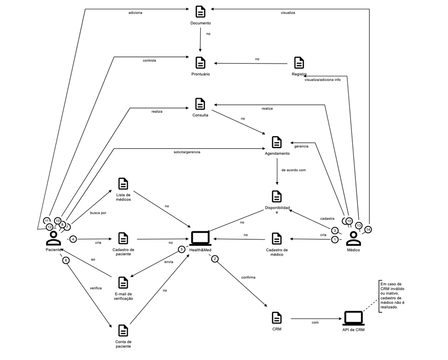
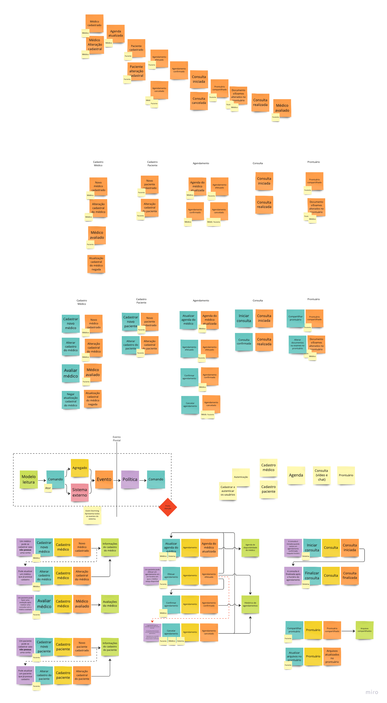

# DDD

## Glossário Ubíquo

### Telemedicina

A prática de realizar consultas médicas de forma remota, utilizando plataformas de videoconferência para comunicação entre médicos e pacientes.

### Teleconsulta

Consulta médica realizada online através de uma plataforma de videoconferência, onde o paciente e o médico interagem remotamente.

### Prontuário Eletrônico

Um sistema de TI que armazena um conjunto de informações médicas, incluindo documentos, exames, cartões de vacinas e outros documentos médicos.

### Médico

Profissional de saúde registrado e autorizado a exercer a medicina, responsável por realizar as consultas médicas. No sistema, os médicos vão cadastrar sua disponibilidade, aceitar ou recusar agendamentos, solicitar acesso para adicionar informações a prontuários eletrônicos, etc.

### Paciente

Indivíduo que busca atendimento médico e utiliza o sistema para buscar médicos, agendar e realizar as consultas, avaliar médicos, e gerenciar seu prontuário eletrônico, incluindo o upload e compartilhamento de documentos.

### CRM (Conselho Regional de Medicina)

Um número de registro único criado pelo Conselho Regional de Medicina (estadual) que certifica que um médico pode exercer a profissã0. Este número é utilizado para a autenticação do médico no sistema.

## Storytelling

[Baixar .egn](diagrams/storytelling.egn)

## Event Storming

